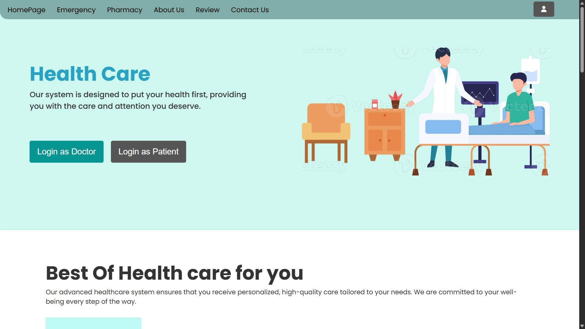
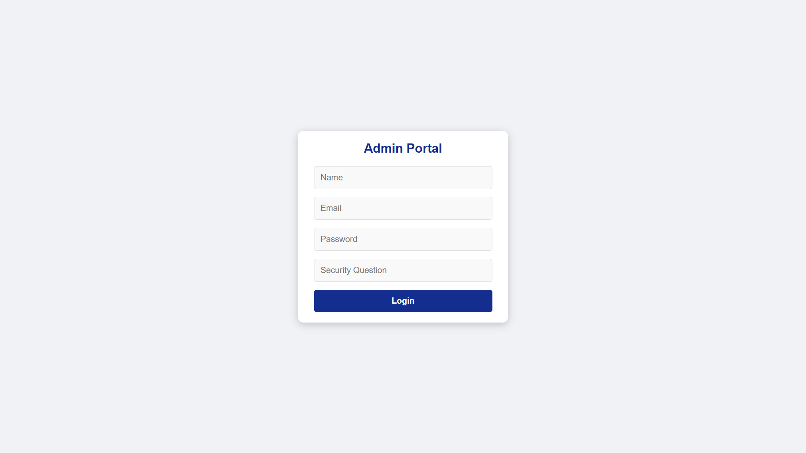
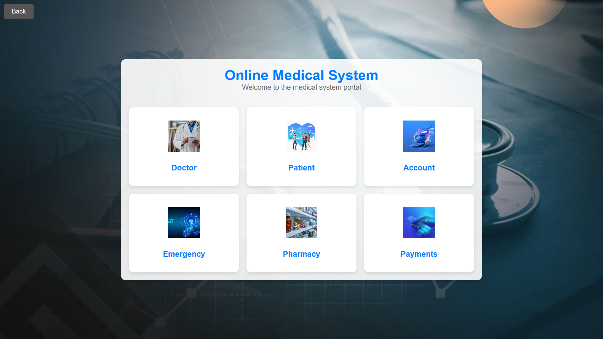
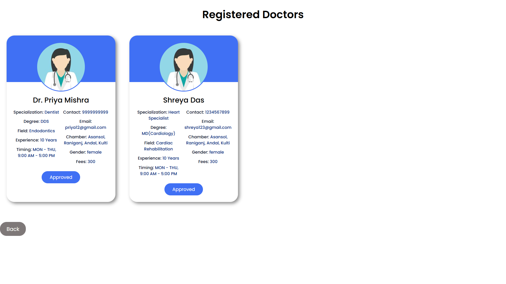
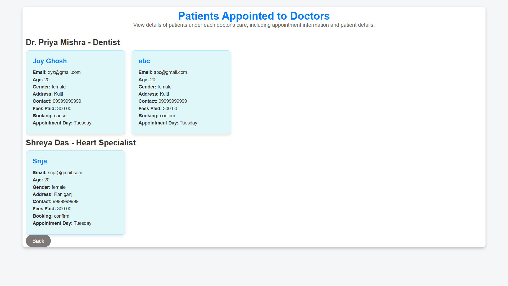
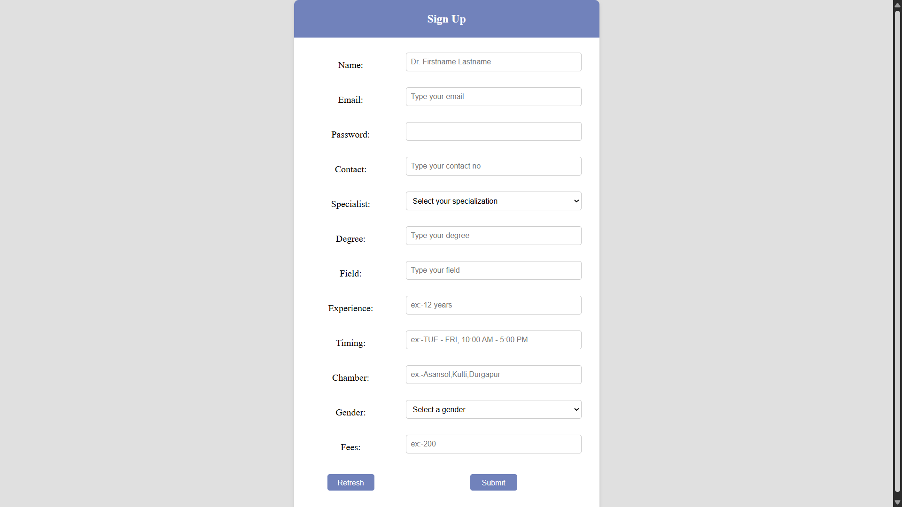
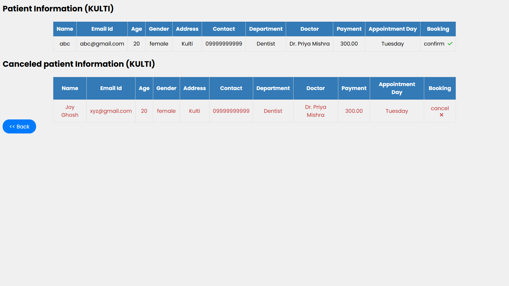
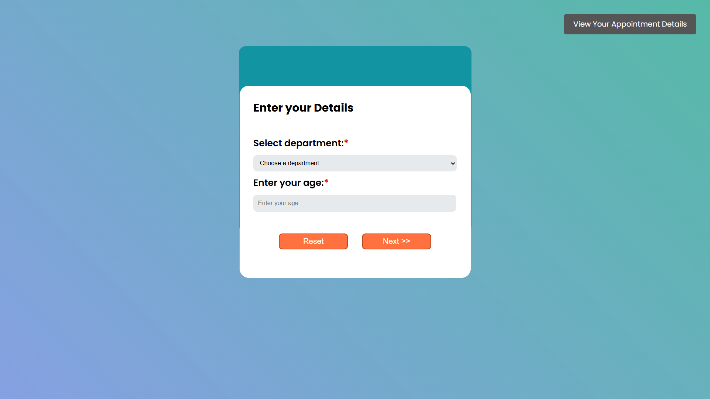
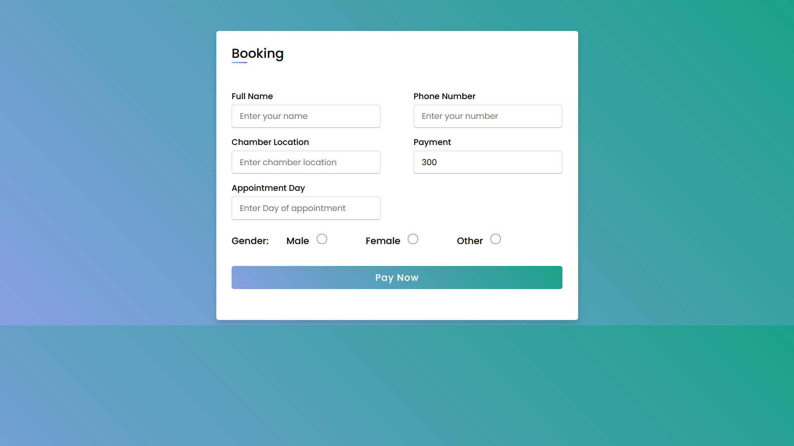
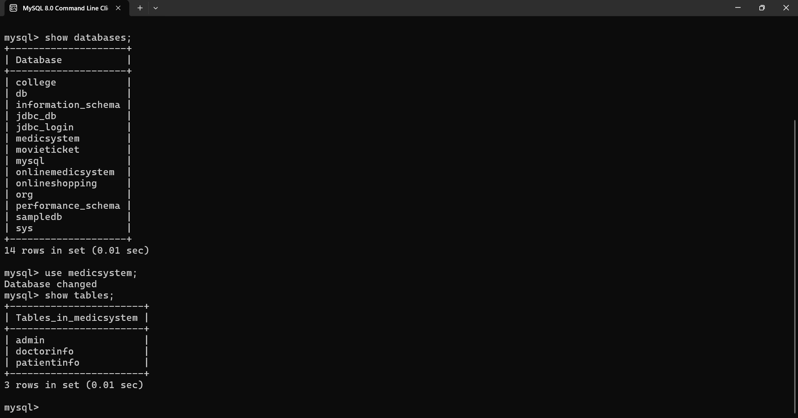

# Online Medic System

## Description
Online Medic System is a Health Care Web Application developed to provide users with convenient access to medical facilities and online medicine booking services. The platform enables users to book doctor appointments, order medicines online, and access essential healthcare services from the comfort of their homes. It ensures secure user authentication, real-time updates, and smooth navigation with a responsive and user-friendly design.

## Technologies Used

- ### Java  
  Core backend logic and business operations.

- ### Servlet  
  Handling dynamic web content and request-response cycle.

- ### MySQL  
  Database management system for storing user and medical data.

- ### Tomcat Server  
  Web server for deploying the project.

- ### Cookies and Sessions  
  Used for secure user data storage and session management.

- ### HTML  
  Structuring the web pages.

- ### CSS  
  Styling the website and making it responsive.

- ### JavaScript  
  Basic interactivity and client-side functionality.

## Features

- User-friendly interface for booking doctor appointments and ordering medicines.
- Secure user authentication and session management.
- Responsive website design for smooth browsing experience across devices.
- Dynamic content rendering using JSP and Servlets.
- Reliable and secure data storage with MySQL database.
- Medicine booking and appointment scheduling with real-time updates.

## Roadmap

### Getting Started

#### Prerequisites
- Java Development Kit (JDK)
- Apache Tomcat Server
- MySQL Server
- Eclipse IDE (or any preferred Java IDE)

### Installation

1. Clone the Repository:

bash
git clone https://github.com/sumanapanda/OnlineMedicSystem.git

2. Open the project in your preferred IDE.

3. Configure the Tomcat server in your IDE.

4. Set up the MySQL database:

sql
CREATE DATABASE medicsystem;

> Run the SQL scripts provided in the sql/ directory to set up the tables and initial data.

5. Modify the database configuration in the project files to match your MySQL setup.

6. Deploy the project on the Tomcat server.

## Screenshots

### Home Page  
A welcoming overview of the platform, providing easy navigation to book appointments or order medicines online.

### Admin Pages  
Dedicated interface for administrators to manage users, doctors, appointments, and overall platform operations efficiently.

### Doctor Sign Up Page  
A registration page for doctors to create their profiles and join the platform to start managing appointments and patient interactions.

### Appointments Page  
Displays scheduled appointments, allowing users to view, manage, or update their bookings with ease.

### Patient Login Page 
Secure login portal for patients to access their accounts, view bookings, and manage medical services.

### Patient Booking Page
A step-by-step interface where patients can search for doctors and schedule appointments based on availability.

### Booking Confirmation Page 
Final step of the booking process where patients review and confirm their appointment details.

### Database Screenshot 
A visual representation of the backend database structure showcasing how patient, doctor, and appointment data are stored and organized.

## Author
Sumana Panda  
3rd Year B.Tech | Information Technology  
Asansol Engineering College
